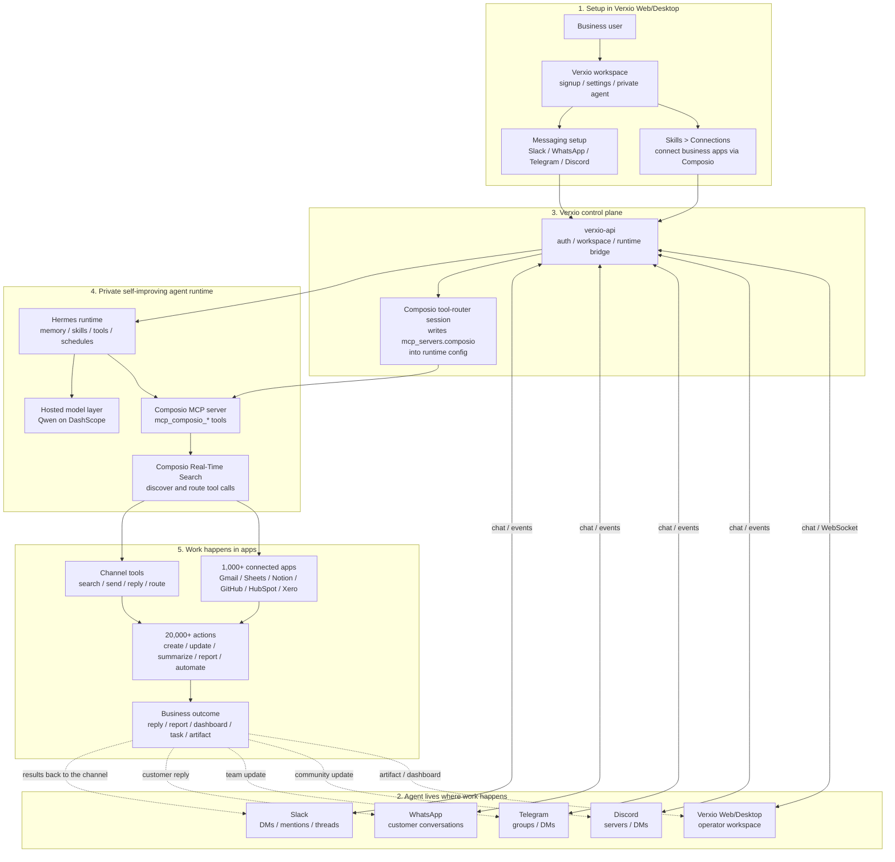
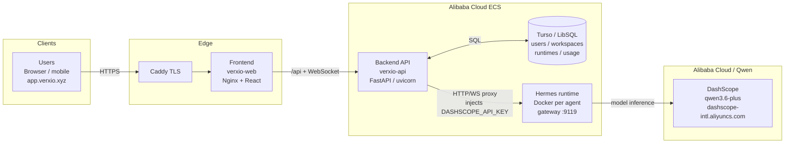

# Verxio AI

Verxio is an AI employee for businesses, not another chatbot.

Most AI products stop at conversation. Verxio is built for follow-through: it
remembers the business context, connects to the tools a team already uses, runs
workflows, creates reports, replies to customers, schedules recurring work, and
gets better over time.

Verxio can live where work already happens: WhatsApp, Slack, Telegram, Discord,
the web app, and the desktop app. A business can talk to the same agent from a
team channel, a customer messaging inbox, or the Verxio workspace without
starting over each time.

Every customer gets a private Verxio workspace with isolated memory,
credentials, skills, files, artifacts, and runtime state. The product goal is
simple: give non-technical businesses access to powerful AI agents without
making them manage developer tools, API keys, scripts, or infrastructure.

## Why Verxio Exists

Businesses do not need another chat window that answers questions and forgets
what happened yesterday. They need an AI teammate that can:

- Understand their workflows and remember what works.
- Take action across business systems instead of only suggesting next steps.
- Operate inside the messaging channels their team and customers already use.
- Improve from repeated work by building reusable skills and memory.
- Stay isolated, auditable, and safe when handling credentials and customer
  data.

Verxio turns advanced agent infrastructure into a product a business can sign up
for and use immediately.

## What Verxio Does

Verxio gives every business a self-improving AI agent that can work across
communication channels, internal tools, and scheduled workflows.

- **Lives in business channels** - use the same agent from WhatsApp, Slack,
  Telegram, Discord, Verxio Web, or Verxio Desktop.
- **Takes real action** - use browser automation, file tools, code execution,
  scheduled jobs, artifacts, and connected business apps.
- **Connects to business software** - connect Gmail, Google Sheets, Google
  Drive, Notion, GitHub, HubSpot, Jira, Xero, Slack, and 1,000+ apps through
  Composio, with access to 20,000+ possible actions.
- **Learns continuously** - remember prior work, reuse successful workflows,
  create skills, and become more useful every day.
- **Automates customer messaging with Pulse** - build visual workflows for
  Instagram, Messenger, and WhatsApp that qualify leads, tag conversations,
  respond to customers, and route follow-up.
- **Captures meetings with Notepad** - record meetings, generate transcripts,
  create AI summaries, organize notes, and share public read-only links.
- **Runs scheduled work** - execute recurring reporting, research, follow-up,
  and operational tasks automatically.
- **Keeps customers isolated** - each workspace has dedicated runtime state,
  credentials, memory, skills, and files.

Think of Verxio as an AI employee that can sit in your messaging channels,
understand your business systems, and do the work instead of only discussing it.

## Business Use Cases

Verxio is designed for practical business operations:

- **Sales and support** - respond to inbound WhatsApp or Instagram messages,
  qualify leads, tag conversations, and escalate hot opportunities.
- **Operations** - update spreadsheets, reconcile records, create weekly
  reports, and keep dashboards fresh.
- **Finance and admin** - gather invoice context, check transactions, summarize
  account activity, and prepare follow-up tasks.
- **Team knowledge** - search Slack history, summarize decisions, retrieve
  files, and answer questions using previous work.
- **Product and engineering** - connect GitHub, Jira, Slack, and docs to
  summarize issues, draft updates, and automate routine project work.
- **Meetings** - record calls, transcribe conversations, summarize outcomes,
  and turn action items into follow-up work.

The same agent can handle a quick Slack question, a WhatsApp customer request,
a scheduled Monday report, and a desktop meeting summary while sharing the same
workspace context.

## Product Surfaces

Verxio has several product surfaces that all point at the same private agent:

- **Verxio Web** - the main browser workspace for chat, settings, skills,
  connections, automations, artifacts, Pulse, and Notepad.
- **Verxio Desktop** - the native app for local file access, terminal access,
  system-aware workflows, and desktop meeting capture.
- **Messaging gateways** - Slack, WhatsApp, Telegram, Discord, and other
  supported platforms let the agent work where teams already communicate.
- **Pulse** - the visual automation layer for customer messaging workflows.
- **Notepad** - the meeting workspace for transcripts, AI summaries, folders,
  and shareable notes.
- **Skills and Connections** - the place where businesses connect apps, manage
  capabilities, and teach the agent reusable workflows.

## Product Architecture

Verxio is the product layer: users, workspaces, billing-ready control plane,
runtime orchestration, web/desktop interfaces, artifacts, Pulse, Notepad, and
messaging setup.

Hermes is the internal self-improving agent runtime that powers memory, tools,
skills, scheduling, delegation, and gateway execution. Users interact with
Verxio; the runtime remains an implementation detail behind the product.

The diagram below keeps Slack visible because Slack can be both a messaging
channel and a connected business app, but the same model applies to WhatsApp,
Telegram, Discord, Web, and Desktop.



There are two paths through messaging platforms:

1. **Messaging** - the agent can receive and respond to messages in Slack,
   WhatsApp, Telegram, Discord, Web, and Desktop.
2. **Tools** - the same platform can also be a connected app. For example,
   Slack can be where the agent receives a request and also a tool the agent
   searches or posts into through Composio.

Flow: **configure in Verxio -> talk in your channel -> private runtime reasons
and plans -> Composio discovers the right action -> work happens in business
apps -> results return to the channel or workspace.**

## Infrastructure Architecture

Production runs on **Alibaba Cloud ECS**.



### DashScope media tools (image / video / TTS)

Qwen Cloud / DashScope media models are **not** chat-model-picker entries.
They use Hermes’ existing tools with a `dashscope` provider:

| Tool             | Config                                                       | Example models                                                            |
| ---------------- | ------------------------------------------------------------ | ------------------------------------------------------------------------- |
| `image_generate` | `image_gen.provider: dashscope`                              | `qwen-image-2.0-pro` (text-to-image), `qwen-image-edit-plus` (image edit) |
| `video_generate` | `video_gen.provider: dashscope` + enable `video_gen` toolset | `happyhorse-1.1` / `wan2.7` families (text-to-video / image-to-video)     |
| `text_to_speech` | `tts.provider: dashscope`                                    | `qwen3-tts-flash`, CosyVoice when available                               |

Auth reuses `DASHSCOPE_API_KEY` (hosted Verxio Qwen or BYOK Qwen Cloud).
Configure via Settings → Voice / Advanced, or `hermes tools`.

## How It Is Built

Verxio is a hosted AI agent product built on top of Hermes Agent, Nous
Research's open-source self-improving agent framework, and developed with
OpenAI Codex and GPT models.

Hermes provides the underlying agent framework. OpenAI's GPT models power key
intelligence and reasoning capabilities inside the Verxio experience, while
Codex played a central role in the development workflow: helping build,
iterate, debug, and ship the product across the API, web, desktop, and runtime
codebases.

Verxio brings these components together into a complete product experience. The
split is intentional:

- **Verxio owns the product experience** - authentication, workspaces, runtime
  lifecycle, web and desktop apps, app connections, Pulse, Notepad, artifacts,
  usage metering, and messaging setup.
- **The runtime owns agent behavior** - memory, skills, tools, scheduled work,
  messaging execution, delegation, and self-improvement.
- **Users can bring their own model access** - Verxio is designed so users can
  connect provider accounts, including ChatGPT/Codex-style subscriptions or API
  keys, and use those credentials as model providers instead of being locked to
  a single hosted default.

### Where Codex Accelerated the Build

Codex was used as an active engineering partner throughout the project, not
only as a code completion tool. GPT-5.6 and Codex helped turn the idea into a
working product by accelerating:

- **Architecture decisions** - separating the Verxio control plane from the
  Hermes runtime, isolating each customer workspace in its own runtime
  container, and keeping product metadata separate from agent memory, skills,
  credentials, sessions, and artifacts.
- **Cross-stack implementation** - building and iterating across `verxio-api`,
  `verxio-web`, `verxio-desktop`, and `hermes-agent` while preserving the
  boundaries between hosted product code and runtime agent behavior.
- **Model-provider design** - wiring hosted providers, user-provided keys, and
  subscription-backed provider access so Verxio can support both managed
  defaults and user-owned model access.
- **Debugging and quality loops** - tracing runtime/session failures, fixing
  environment reload issues, artifact preview bugs, model selector behavior,
  read-aloud support, and agent resume edge cases with targeted tests and
  Docker verification.
- **Product iteration** - shaping Pulse, Notepad, artifacts, messaging,
  settings, skills, runtime orchestration, and desktop capabilities into a
  unified experience instead of separate technical demos.

Key decisions were made with Codex in the loop: which logic belonged in the
hosted Verxio API versus the Hermes runtime, how to preserve runtime isolation,
how to support provider choice without exposing users to infrastructure
complexity, and how to verify fixes with focused tests plus local Docker
runtime rebuilds.

Core directories:

- `verxio-api/` - FastAPI control plane with auth, workspaces, runtime
  orchestration, Composio bridge, Pulse automations, Notepad, artifact
  management, usage metering, and proxying.
- `verxio-web/` - React web app for chat, settings, skills, messaging,
  connections, Pulse, Notepad, and artifacts.
- `verxio-desktop/` - Electron shell that reuses `verxio-web` and enables
  native file access, terminal support, system audio recording, and desktop
  bridge APIs.
- `hermes-agent/` - underlying agent runtime powering memory, skills,
  messaging, scheduling, delegation, and tool execution.
- `.verxio/` - local runtime state, runtime homes, workspaces, and artifacts.

Verxio-specific product changes live in `verxio-api`, `verxio-web`, and
`verxio-desktop`. Runtime changes are kept inside `hermes-agent`. Hermes
provides the agent foundation, OpenAI's GPT models provide intelligence, Codex
accelerated how the system was built and shipped, and Verxio turns it into an
accessible, integrated product.

## Runtime Isolation

Each workspace agent gets one isolated runtime container:

```text
.verxio/runtimes/{workspace_id}/{agent_id}/hermes-home
.verxio/runtimes/{workspace_id}/{agent_id}/workspace
.verxio/runtimes/{workspace_id}/{agent_id}/workspace/artifacts
```

Turso stores Verxio control-plane metadata only: users, sessions, workspaces,
agents, runtime instances, artifacts, usage, and audit events. Agent memory,
sessions, skills, cron jobs, MCP config, gateway connections, and `SOUL.md`
remain inside that agent's private runtime home.

This separation lets Verxio provide a polished hosted product while preserving
per-customer isolation for credentials, memory, learned skills, files, and
generated artifacts.

## Pulse

Pulse is Verxio's automation layer for customer messaging. It lets businesses
build visual workflows for Instagram, Messenger, and WhatsApp so the agent can:

- Respond to inbound messages.
- Qualify leads.
- Tag customers and conversations.
- Route conversations by status, intent, or source.
- Trigger follow-up work across connected apps.

Pulse is designed around channel capabilities, so businesses can understand what
each messaging platform allows before they automate customer communication.

## Notepad

Notepad is the meeting workspace inside Verxio. Users can create notes, edit
transcripts and summaries, organize notes into folders, delete records, and
create public share URLs that can be viewed without signing in.

On web, Notepad provides notes, folders, editing, AI summaries, and public
sharing. In the desktop app it additionally supports bot-free recording:
Verxio requests device audio where Electron exposes it and falls back to
microphone recording when system audio is unavailable.

Transcription uses the runtime audio transcription route, and AI summaries use
the same private agent runtime backing the workspace.

## Verxio Desktop

The desktop shell uses the same Verxio Web renderer, but provides a native
`window.hermesDesktop` bridge so desktop-only UI, including the right sidebar
file browser and terminal, is available on macOS, Windows, and Linux.

Desktop keeps local bridge state on the user's machine, including local
identity, remembered folder grants, terminal access, and file preview
permissions.

Start `verxio-api` first, then run the desktop app locally:

```bash
npm run desktop:dev
```

This starts `verxio-web` on `http://127.0.0.1:5180` and launches Electron
against it. The local build smoke check is:

```bash
npm run desktop:build
```

To create an unpacked installable app directory for the current platform, run:

```bash
npm run desktop:pack
```

Platform-specific unsigned installers are available from `verxio-desktop`:

```bash
npm run dist:mac --prefix verxio-desktop
npm run dist:win --prefix verxio-desktop
npm run dist:linux --prefix verxio-desktop
```

## Local Docker Parity

Local Docker uses the same routes, auth flow, database schema, runtime registry,
and container shape as production. The main difference is where containers run.

```bash
cp .env.verxio.example .env
# Fill TURSO_DATABASE_URL and TURSO_AUTH_TOKEN.

docker compose -f docker-compose.verxio.yml --profile image build hermes-runtime-image verxio-api verxio-web
docker compose -f docker-compose.verxio.yml up verxio-api verxio-web
```

For first local testing without Turso, set these in `.env` before `up`:

```bash
VERXIO_DATABASE_MODE=sqlite
VERXIO_RUNTIME_DOCKER_ROOT=/Users/donatusprince/Desktop/projects/verxio-ai/.verxio/runtimes
VERXIO_RUNTIME_CONNECT_HOST=host.docker.internal
VERXIO_RUNTIME_PUBLISH_HOST=127.0.0.1
```

Open:

```text
http://127.0.0.1:8080
```

Deployment test login:

```text
Email: donatusprince@gmail.com
Password: 123456789
```

Signup creates a user, personal workspace, default Verxio agent, runtime
registry row, isolated runtime home, workspace, and artifact directory.

## Challenges Solved

Verxio turns an advanced agent runtime into a business product by solving the
parts businesses need before they can trust AI in production:

- **Isolated runtimes** - every customer gets dedicated memory, credentials,
  skills, and files.
- **Multi-channel messaging** - the same agent can operate across WhatsApp,
  Slack, Telegram, Discord, Web, and Desktop while preserving context.
- **Tool access without developer setup** - Composio connects business apps and
  routes tool execution without users managing raw MCP details.
- **Product/runtime state separation** - Verxio stores product data while the
  runtime stores memory and learning.
- **Desktop support** - native bridge APIs unlock file, terminal, and recording
  capabilities without fragmenting the web product.
- **Business-grade workflows** - Pulse, Notepad, scheduled work, artifacts, and
  app connections make the agent useful beyond chat.

## What We Learned

AI agents are only valuable when they are accessible, trusted, and embedded in
real work.

Powerful runtimes are not enough. Businesses need authentication, secure
infrastructure, isolated workspaces, polished interfaces, reliable integrations,
and clear product flows before they can use AI in production.

Users also do not want another app to manage. They want AI inside the messaging
platforms they already use every day.

Most importantly, learning changes the product. A chatbot starts every
conversation from scratch. A self-improving agent builds knowledge, remembers
successful workflows, creates reusable skills, and becomes more valuable with
continued use.

## License

Verxio AI is public and open source under the [MIT License](./LICENSE).

The license file is included at the repository root so GitHub can detect it and
show it in the About section on the repository page.
